# MÃ NGUỒN SƠ ĐỒ (PlantUML) – Tech Gadget & Electronics Store

> **Cách dùng:** Dán từng khối mã `@startuml … @enduml` vào một trong các công cụ sau để render thành hình:
> - **PlantUML online:** https://www.plantuml.com/plantuml
> - **VS Code:** cài extension *PlantUML* (Alt+D để xem trước)
> - **draw.io / diagrams.net:** Arrange → Insert → Advanced → **PlantUML**
> - **StarUML / Visual Paradigm:** import PlantUML
>
> Sau khi render, xuất ảnh PNG/SVG rồi chèn vào đúng vị trí `[CHÈN HÌNH x.y]` trong file Word.
> Mã đã dùng UTF-8 (tiếng Việt có dấu) — giữ nguyên khi lưu file.

---

## HÌNH 2.1 – SƠ ĐỒ PHÂN RÃ CHỨC NĂNG

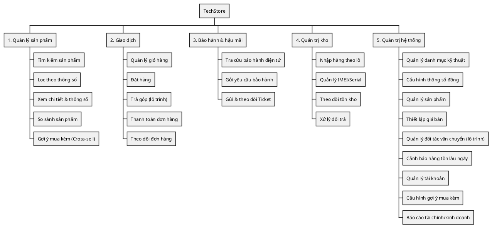

---

## HÌNH 2.2 – BIỂU ĐỒ HOẠT ĐỘNG CHUNG CỦA HỆ THỐNG

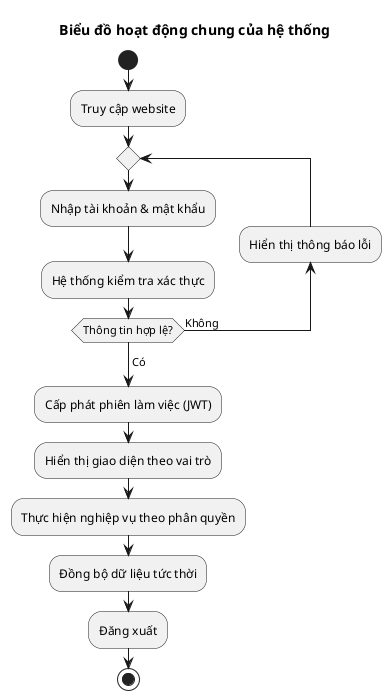

---

## HÌNH 2.3 – BIỂU ĐỒ HOẠT ĐỘNG ĐẶT HÀNG VÀ THANH TOÁN

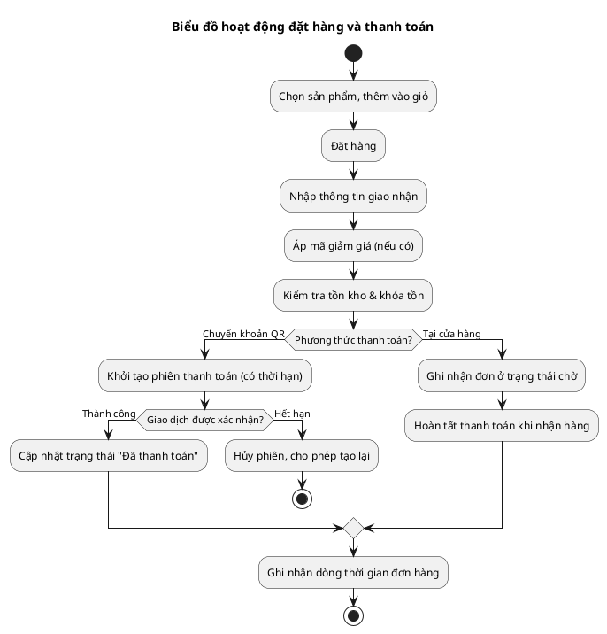

---

## HÌNH 2.4 – BIỂU ĐỒ HOẠT ĐỘNG BẢO HÀNH VÀ SỬA CHỮA

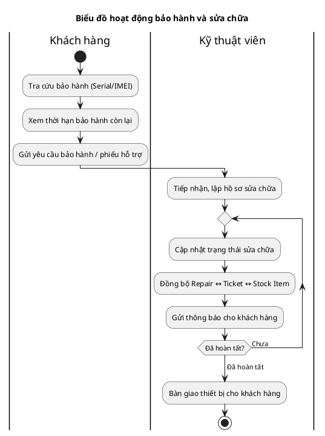

---

## HÌNH 2.5 – BIỂU ĐỒ HOẠT ĐỘNG QUẢN LÝ KHO

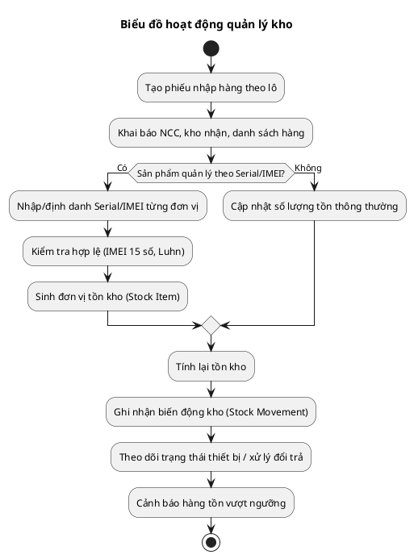

---

## HÌNH 2.6 – BIỂU ĐỒ HOẠT ĐỘNG QUẢN TRỊ HỆ THỐNG

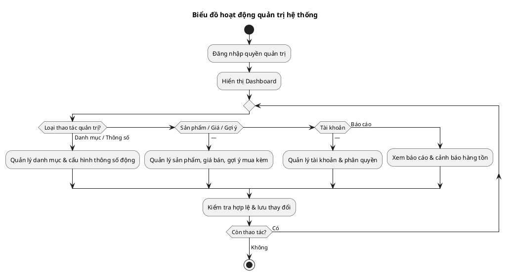

---

## HÌNH 3.1 – USE CASE TỔNG QUAN

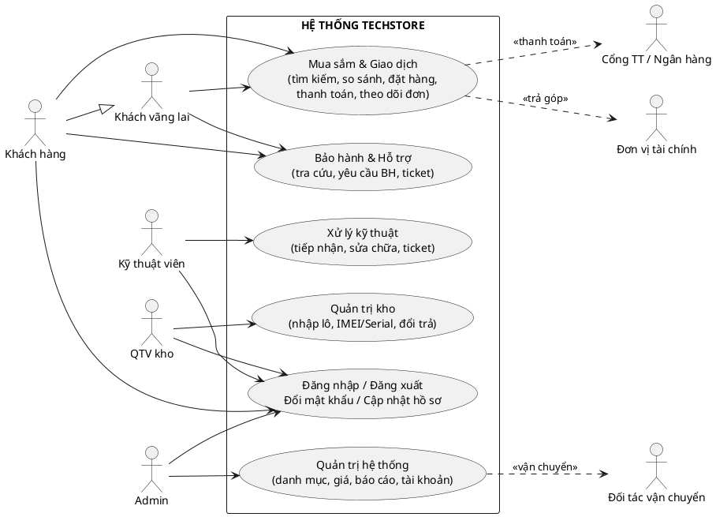

---

## HÌNH 3.2 – USE CASE KHÁCH HÀNG

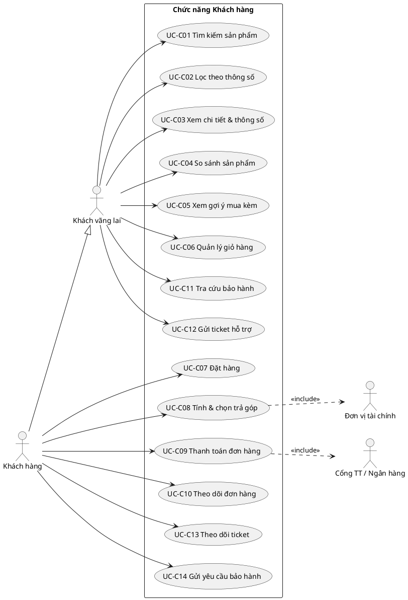

---

## HÌNH 3.3 – USE CASE KỸ THUẬT VIÊN

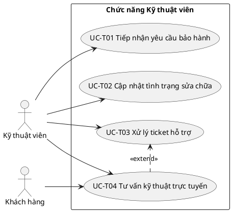

---

## HÌNH 3.4 – USE CASE QUẢN TRỊ VIÊN KHO

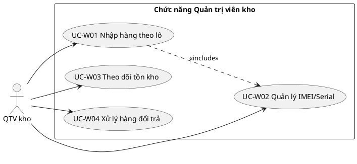

---

## HÌNH 3.5 – USE CASE QUẢN TRỊ VIÊN HỆ THỐNG

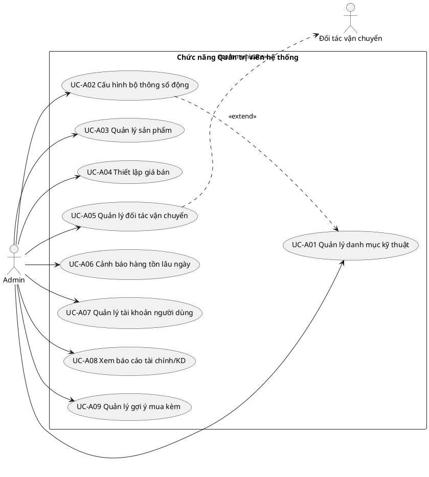

---

## GHI CHÚ
- Các quan hệ `<<include>>`, `<<extend>>` đã được thể hiện đúng theo phần đặc tả (ví dụ UC-T04 mở rộng UC-T03; UC-C08/C09 include tới tác nhân ngoài).
- Quan hệ `C --|> G` (Khách hàng kế thừa Khách vãng lai) thể hiện: khách đã đăng nhập làm được mọi thao tác công khai của khách vãng lai, cộng thêm các chức năng cá nhân.
- Nếu bạn muốn, tôi có thể chuyển sang **Mermaid** (dùng cho Markdown/Notion) hoặc xuất **file .drawio** để bạn mở thẳng bằng draw.io.
```
